# 🛍️ EasyShop

Benvenuti in **EasyShop**, il mio progetto personale di eCommerce nato dalla voglia di creare una piattaforma online semplice, sicura e completa. Negli ultimi mesi ho investito tempo ed energie per realizzare un'applicazione che non fosse solo funzionale, ma anche facile da usare, con un occhio attento alla sicurezza e all’esperienza utente.

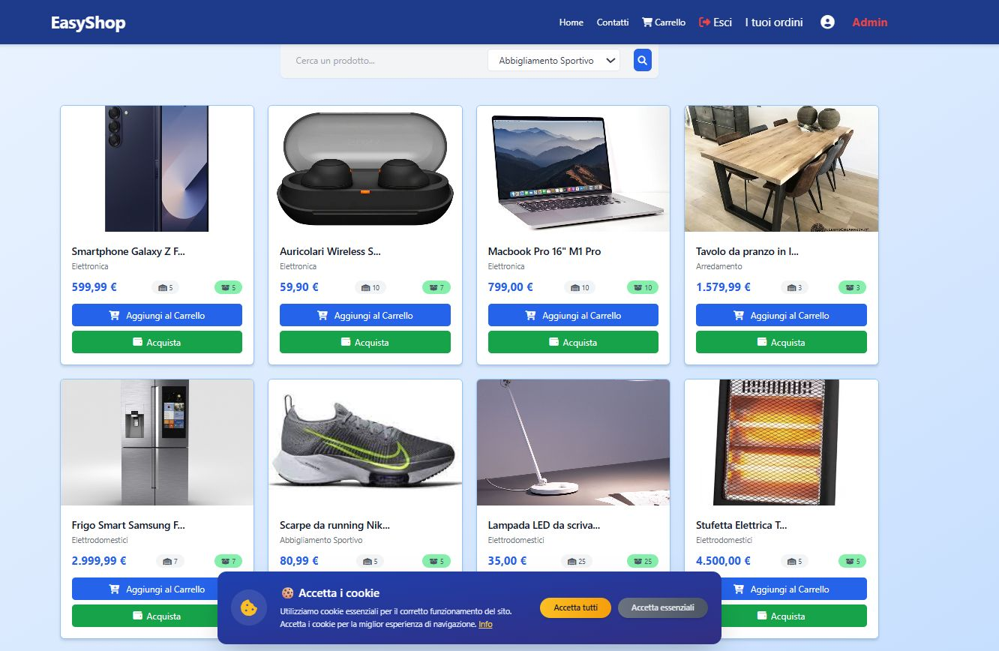  
*Mockup della homepage di EasyShop*

## 💻 Tecnologie principali

Il progetto è diviso in due macro-componenti, ognuna con le sue responsabilità:

- **Frontend**  
  Realizzato con **Razor Pages** e stilizzato con **Tailwind CSS**, per un’interfaccia pulita e responsive.

- **Backend**  
  Sviluppato in **ASP.NET Core Web API**, utilizza **Entity Framework Core** per gestire il database SQL Server, garantendo performance e sicurezza.

---

## 🔐 Sicurezza

La sicurezza è stata una priorità sin dall’inizio:  
- Autenticazione tramite **JWT salvato in cookie HttpOnly** per prevenire attacchi XSS.  
- Integrazione di **2FA (verifica in due fattori)** per proteggere gli account.  
- Gestione robusta di credenziali e sessioni per un’esperienza utente fluida ma sicura.
- Utilizzo di Microsoft Identity per la gestione e store sicuro dei dati utente.

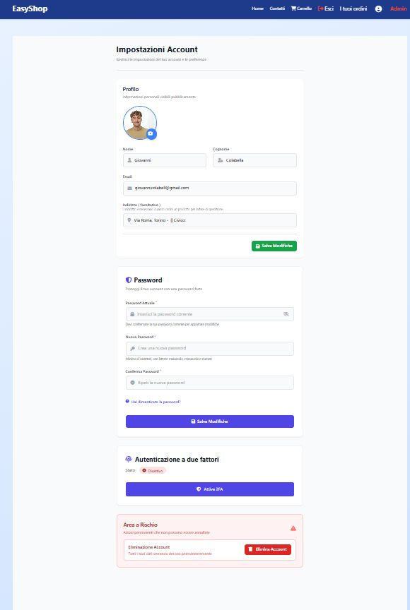  
*Esempio di autenticazione a due fattori*

---

## 💳 Pagamenti

Ho integrato la piattaforma con **PayPal** per consentire pagamenti reali e sicuri, sia per singoli prodotti che per l’intero carrello. Ogni ordine viene tracciato con precisione, permettendo agli utenti di visualizzare lo storico.

---

## 🧾 Funzionalità principali

- Navigazione intuitiva per categorie prodotto  
- Ricerca e filtri avanzati  
- Schede prodotto dettagliate  
- Gestione carrello con modifica quantità  
- Registrazione e login con JWT  
- Checkout con PayPal  
- Cronologia ordini 
- Notifiche in tempo reale con SignalR  
- Servizio integrato per invio mail (es. conferme ordine)  
- Profilo utente modificabile  
- Pannello admin per gestire prodotti, categorie, ordini e utenti  
- Importazione massiva prodotti da Excel, con mappatura dinamica delle colonne  
- Download di report PDF per ordini e statistiche

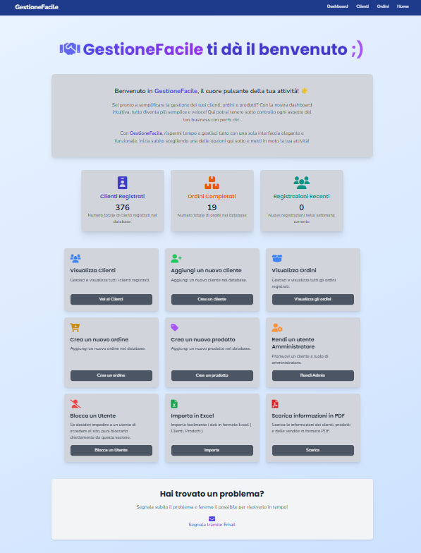  
*Pannello di controllo amministrativo*

---

## ✨ Considerazioni finali

EasyShop è stata per me un’esperienza davvero importante per crescere come sviluppatore full stack e affrontare problemi concreti legati al mondo reale. Essendo il mio primo progetto serio, ammetto che all’inizio il codice non era proprio pulitissimo né facilissimo da leggere. Però con il tempo e l’esperienza sono migliorato parecchio: ora scrivo codice molto più chiaro, modulare e facile da mantenere. Continuo a imparare e a migliorarmi ogni giorno, e sono davvero soddisfatto di quanto ho fatto finora.

---

Grazie a tutti ! :)
---
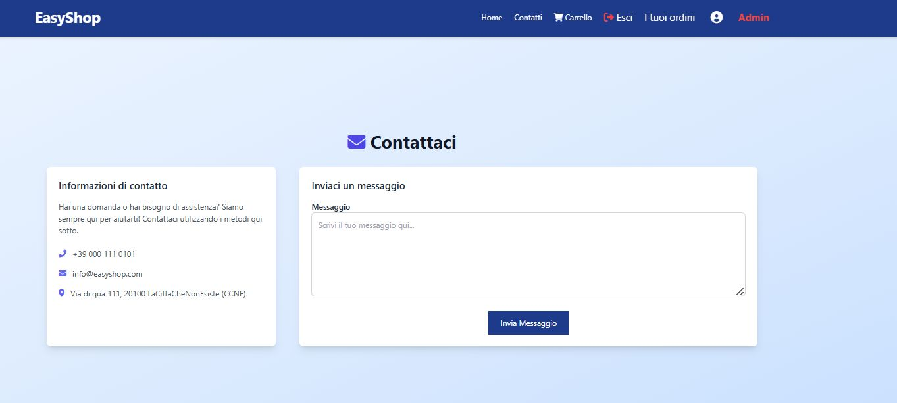  
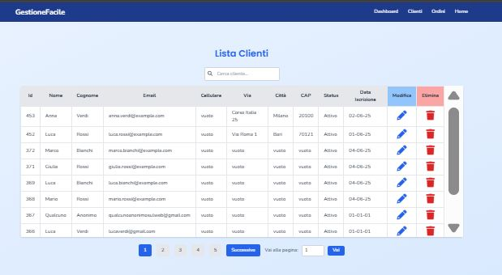  
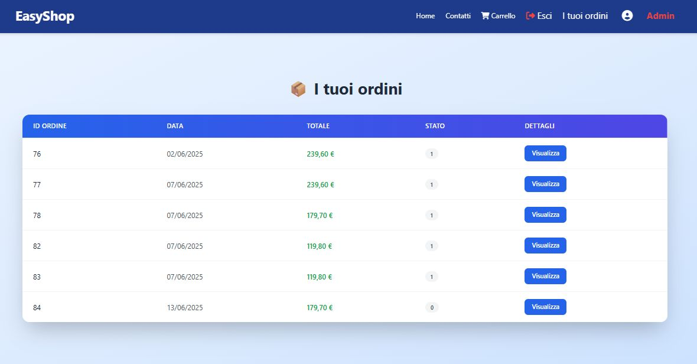  
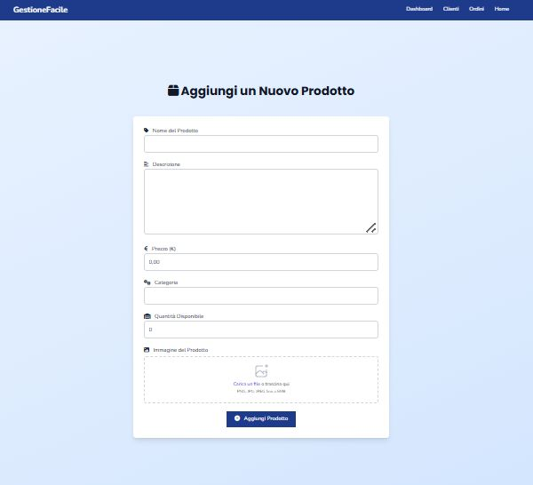  
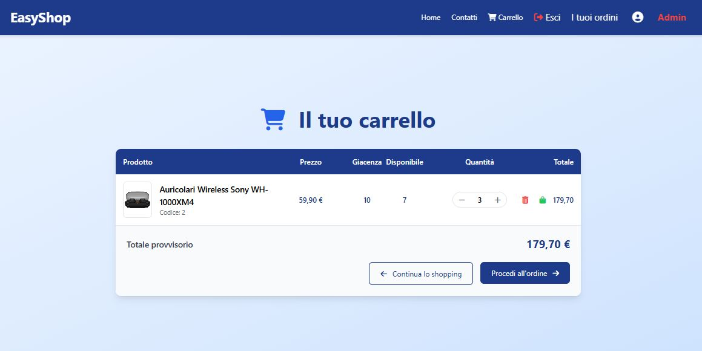  
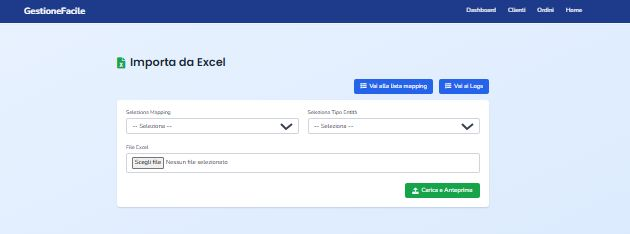  
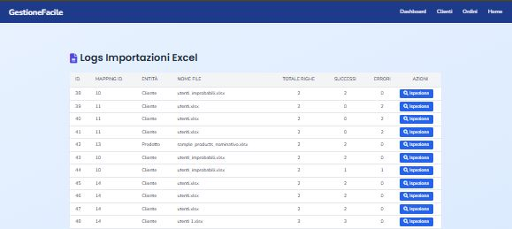  
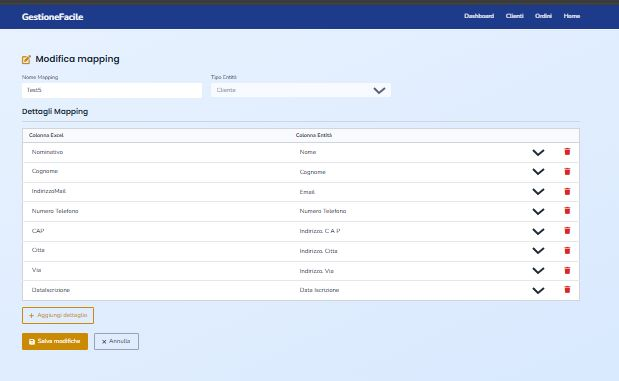  
  
